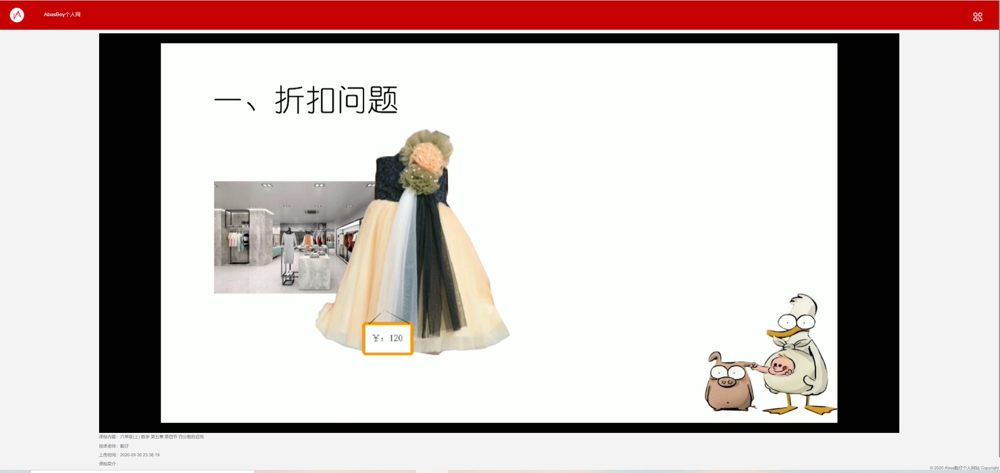
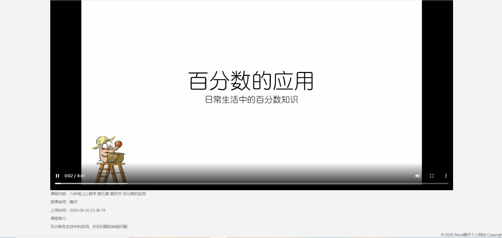

# 个人视频网站
演示地址：http://182.92.219.12/
教学视频播放网站，前后台不分离，感谢诺依手脚架开发者的共享，此系统在若依的基础上进行二次开发。

## 效果

#### 后台

#### 前台

![]imgs/home.png)

#### 详情

## 技术选型

**1、系统环境**

- Java EE 8
- Servlet 3.0
- Apache Maven 3

**2、主框架**

- Spring Boot 2.0
- Spring Framework 5.0
- Apache Shiro 1.4

**3、持久层**

- Apache MyBatis 3.4
- Hibernate Validation 6.0
- Alibaba Druid 1.1

**4、视图层**

- Bootstrap 3.3
- Thymeleaf 3.0

## 内置功能

- 用户管理：用户是系统操作者，该功能主要完成系统用户配置。
- 部门管理：配置系统组织机构（公司、部门、小组），树结构展现支持数据权限。
- 岗位管理：配置系统用户所属担任职务。
- 菜单管理：配置系统菜单，操作权限，按钮权限标识等。
- 角色管理：角色菜单权限分配、设置角色按机构进行数据范围权限划分。
- 字典管理：对系统中经常使用的一些较为固定的数据进行维护。
- 参数管理：对系统动态配置常用参数。
- 通知公告：系统通知公告信息发布维护。
- 操作日志：系统正常操作日志记录和查询；系统异常信息日志记录和查询。
- 登录日志：系统登录日志记录查询包含登录异常。
- 在线用户：当前系统中活跃用户状态监控。
- 定时任务：在线（添加、修改、删除)任务调度包含执行结果日志。
- 代码生成：前后端代码的生成（java、html、xml、sql)支持CRUD下载 。
- 系统接口：根据业务代码自动生成相关的api接口文档。
- 服务监控：监视当前系统CPU、内存、磁盘、堆栈等相关信息。
- 连接池监视：监视当期系统数据库连接池状态，可进行分析SQL找出系统性能瓶颈。
